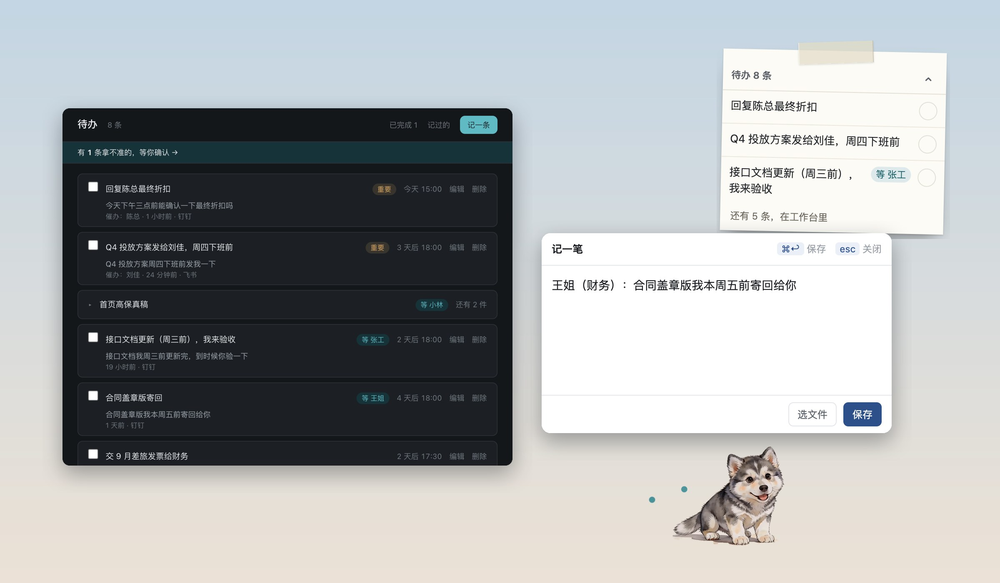

# 我的助理叫阿拉

一只常驻桌面的阿拉斯加小狗。选中一段话、按一个键，它用大模型读懂内容、拆成待办、到点提醒你——连「我在等别人交付」的事也替你盯着。

**产品主页：https://jiangdaren.github.io/ala/**（产品介绍、界面截图、关键产品决策、下载与安装说明）

## 下载

到 [Releases](https://github.com/jiangdaren/ala/releases/latest) 下载对应安装包。国内直连 GitHub 通常下载不了，需要开 VPN；**没有 VPN 请用[百度网盘](https://pan.baidu.com/s/1CeV8UgJTyuZRQTnKoK-Zqg?pwd=j66g)**（提取码 j66g）。

| 系统 | 文件 |
|---|---|
| macOS · Apple 芯片（M1–M4） | `Ala-0.2.0-mac-arm64.dmg` |
| macOS · Intel | `Ala-0.2.0-mac-intel.dmg` |
| Windows 10 / 11（64 位） | `Ala-0.2.0-win-x64.exe` |

安装包暂未购买平台签名证书，第一次打开会被系统拦一下，放行步骤见[产品主页](https://jiangdaren.github.io/ala/#download)。AI 功能需要自备 DeepSeek API Key。

## 关于

作者：蒋中林。需求、产品设计、提示词与评测、研发交付均独立完成。
